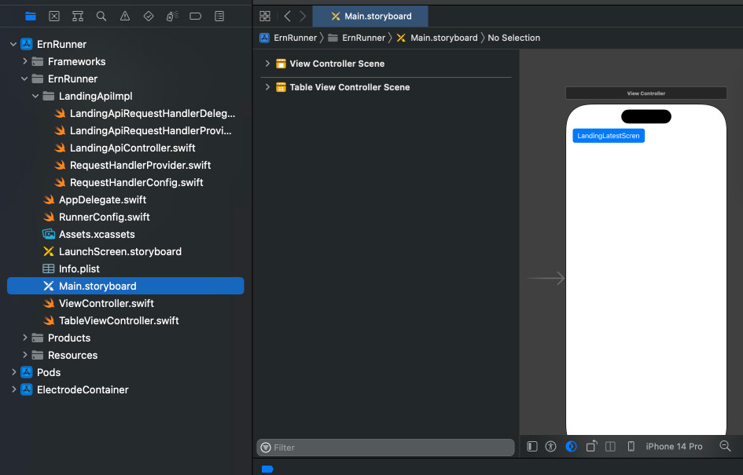

# React Native Assessment

This repository contains an assessment task which is designed for evaluating candidates, who are in the job application process, and intended to help us evaluate the approaches and abilities of those participating.

Within the task, we expect you to complete the project described below. While completing the task, please make sure that you are delivering the best work you can, which will assist us in making an accurate evaluation.


## Requirements

### Technologies to be used:

- JavaScript and/or TypeScript
- Electrode Native (https://github.com/electrode-io/electrode-native)
- Git


### Constraints and Conventions:

- Use of vector file formats for images
- Use of only functional components in React
- Managing form values with state management
- Applying atomic design principles
- Developing the project with frequent commits on version control system
- Use of "conventional commits" convention for commit messages
- Minimum 60% unit testing code coverage
- Writing a markdown documentation to describe how to run it


## How to Get Started?

You can start by creating a Electrode Native project base.

Then, you'll need to transfer this codebase to a git repository and share the repository address upon completion.


## Product Expectations

https://github.com/Teknasyon/assessments-react-native/assets/866558/0323671b-a327-4d3c-9d61-3efc2c289d50

- The project needs to be function as shown in the video below.

- Pick **just one screen** to implement.


## Engineering Expectations

- A miniapp should be created with Electrode Native. Please see: https://native.electrode.io/cli-commands/create-miniapp

- Screen you've picked should be popped up when the first button is clicked

- A native storyboard should be added in the Xcode project as shown below, and a button should be placed.

  

- Sample code to be called when the button is clicked:
  ```swift
  // Function to be called
  openScreen(screenName: "LandingLatestScreen")

  // Function definition
  func openScreen(screenName: String) {
    let viewController = ElectrodeReactNative.sharedInstance().miniApp(withName: “YouTubeLandingMiniapp”, properties: [
        “initialScreen”: screenName
    ], overlay: true, sizeFlexibility: 300, delegate: nil)

    let screenSize: CGRect = UIScreen.main.bounds
    viewController.view.frame = CGRect(x: 0, y: 0, width: screenSize.width, height: screenSize.height)

    self.view.addSubview(viewController.view)
  }
  ```

- On the React Native side, it should be handled as in the `src/App.js` file.

- A `LandingLatestScreen.js` file should be created and suitable codes should be written in it, consistent with the interface.
  Figma: https://www.figma.com/file/rGR9aiS2bhtj574U2teCpH/RN-Assesment?type=design&node-id=0%3A1&mode=design&t=1wKM6el7p5Y7lyUU-1

- When the close button in the screen design is clicked, the React Native interface should be closed and returned to native.

- The process of closing the RN interface and returning to native can be done by creating an electrode API. Sample code:
  ```javascript
  import { LandingApi } from “@youtube/landing-api”;

  export function handleCloseScreen() {
    console.log(“Closing screen”);

    LandingApi.requests()
      .closeScreen()
      .then((response) => {
        console.log(“closeScreen”, response);
      });

    return;
  }
  ```

- The Swift code to be called:
  ```swift
  // LandingApiRequestHandlerProvider.swift
  // ...
  public func registerCloseScreenRequestHandler() {
    _ = landingApi.requests.registerCloseScreenRequestHandler{ (data, completion) in
        let vc =  (UIApplication.shared.keyWindow?.rootViewController)!

        vc.view.subviews[vc.view.subviews.count - 1].removeFromSuperview()

        let resp = GenericResponse(isFinished: true)
        completion(resp, nil)
    }
  }
  ```


## Your Questions

You can send your questions regarding the assessments to [eser@teknasyon.com](mailto:eser@teknasyon.com).


## License

Licensed under [Apache 2.0](LICENSE).
